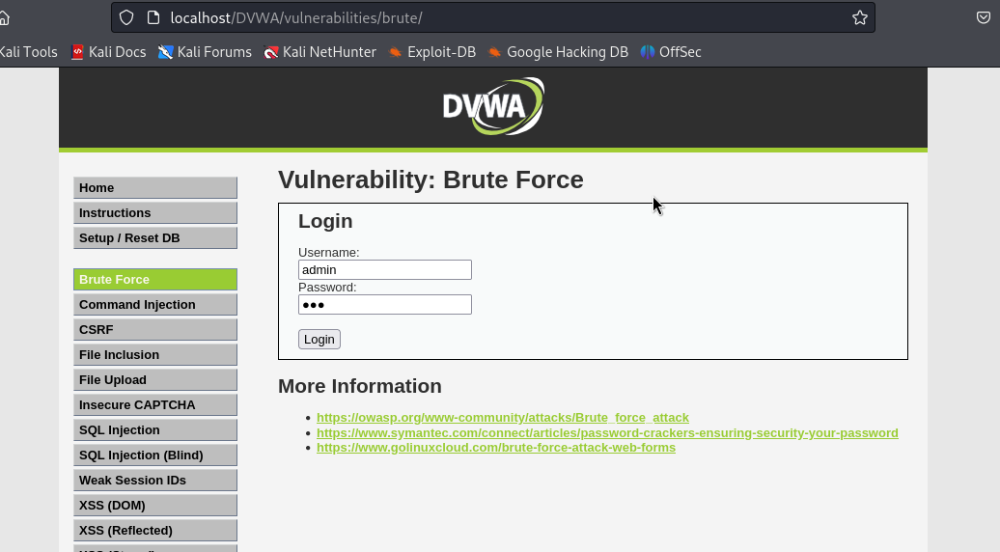
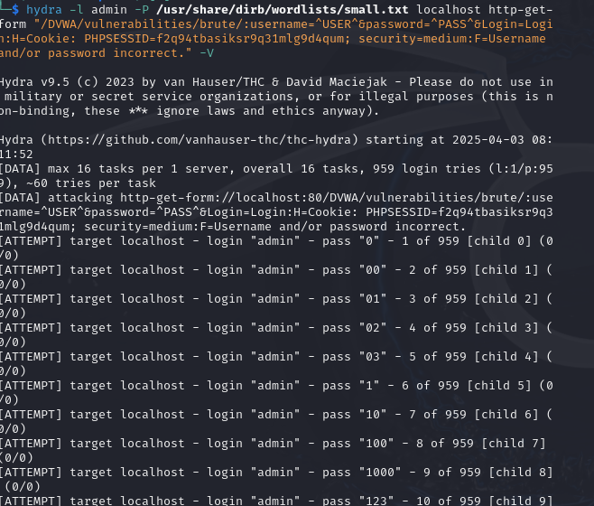

---
# Front matter
lang: ru-RU
title: "Индивидуальный проект - этап 3"
subtitle: "Использование Hydra"
author: "Жапаров Алишер Дастанбекович"

# Formatting
toc-title: "Содержание"
toc: true # Table of contents
toc_depth: 2
lof: true # List of figures
fontsize: 12pt
linestretch: 1.5
papersize: a4paper
documentclass: scrreprt
polyglossia-lang: russian
polyglossia-otherlangs: english
mainfont: PT Serif
romanfont: PT Serif
sansfont: PT Sans
monofont: PT Mono
mainfontoptions: Ligatures=TeX
romanfontoptions: Ligatures=TeX
sansfontoptions: Ligatures=TeX,Scale=MatchLowercase
monofontoptions: Scale=MatchLowercase
indent: true
pdf-engine: lualatex
header-includes:
  - \linepenalty=10 # the penalty added to the badness of each line within a paragraph (no associated penalty node) Increasing the value makes tex try to have fewer lines in the paragraph.
  - \interlinepenalty=0 # value of the penalty (node) added after each line of a paragraph.
  - \hyphenpenalty=50 # the penalty for line breaking at an automatically inserted hyphen
  - \exhyphenpenalty=50 # the penalty for line breaking at an explicit hyphen
  - \binoppenalty=700 # the penalty for breaking a line at a binary operator
  - \relpenalty=500 # the penalty for breaking a line at a relation
  - \clubpenalty=150 # extra penalty for breaking after first line of a paragraph
  - \widowpenalty=150 # extra penalty for breaking before last line of a paragraph
  - \displaywidowpenalty=50 # extra penalty for breaking before last line before a display math
  - \brokenpenalty=100 # extra penalty for page breaking after a hyphenated line
  - \predisplaypenalty=10000 # penalty for breaking before a display
  - \postdisplaypenalty=0 # penalty for breaking after a display
  - \floatingpenalty = 20000 # penalty for splitting an insertion (can only be split footnote in standard LaTeX)
  - \raggedbottom # or \flushbottom
  - \usepackage{float} # keep figures where there are in the text
  - \floatplacement{figure}{H} # keep figures where there are in the text
---

# Цель работы

Целью данной работы является изучение атак типа брут-форс и инструмента hydra.

# Введение

## Брут-форс

Атака брут-форс (англ. brute force attack) — это метод взлома, основанный на последовательном переборе возможных комбинаций значений (паролей, ключей шифрования и т. д.), чтобы подобрать правильное значение и получить несанкционированный доступ.

Атаки брут-форс являются одним из самых простых, но эффективных способов взлома учетных записей, если системы не защищены должным образом. Сильные пароли, ограничения на количество попыток входа и двухфакторная аутентификация могут значительно уменьшить вероятность успешной атаки.

### Основные виды атак брут-форс

1. **Прямой брут-форс**
Это классический метод, при котором осуществляется полный перебор всех возможных комбинаций символов до тех пор, пока не будет найден правильный пароль.

**Пример:**
Если длина пароля 4 символа и каждый символ может быть буквой английского алфавита (всего 26 букв), то количество всех возможных паролей составит 26^4 = 456 976.

2. **Словарная атака**
В этой атаке используется предварительно подготовленный словарь наиболее распространенных паролей или комбинаций. В отличие от прямого брут-форса, здесь перебираются только "умные" комбинации, сокращая количество попыток.

**Пример:**
Использование списка популярных паролей, таких как `123456`, `password`, `qwerty` и других.

3. **Гибридная атака**
Сочетает словарную атаку с частичным перебором. Например, сначала проверяются пароли из словаря, а затем к ним добавляются различные числовые или символьные комбинации.

**Пример:**
Попытки подобрать пароли вида `password123`, `qwerty2024`, где к стандартным паролям добавляются числа.

4. **Атака с использованием «радужных таблиц» (Rainbow Tables)**
В этом случае вместо прямого перебора используется готовая база значений хешей для паролей и их соответствий. Атака эффективна только против плохо защищенных систем, где пароли не солятся.

**Пример:**
Использование таблицы хешей для мгновенного поиска совпадений по хешу пароля.

### Как защититься от атак брут-форс

1. **Использование сложных паролей**
   - Рекомендуется использовать пароли длиной не менее 12 символов, содержащие буквы разного регистра, цифры и специальные символы.

2. **Ограничение количества попыток ввода**
   - Ввод ограничения на количество попыток ввода пароля существенно снижает шансы успешной атаки брут-форс.

3. **Двухфакторная аутентификация (2FA)**
   - Второй фактор подтверждения (SMS, приложения-аутентификаторы) добавляет дополнительный уровень защиты.

4. **Использование CAPTCHA**
   - Применение CAPTCHA усложняет автоматизацию процесса перебора паролей.

5. **Мониторинг активности**
   - Регулярный мониторинг попыток входа в систему может помочь выявить подозрительные активности и предотвратить атаки.

## Hydra

**Hydra** — это мощный инструмент для проведения атак брут-форс на сетевые сервисы. Программа разработана для быстрого и эффективного подбора паролей путем перебора различных комбинаций на множестве протоколов. Hydra поддерживает как простые словарные атаки, так и более сложные сценарии.

### Основные характеристики Hydra

- **Многофункциональность**: Hydra поддерживает множество сетевых протоколов, таких как:
  - SSH
  - FTP
  - HTTP/HTTPS
  - Telnet
  - RDP (Remote Desktop Protocol)
  - POP3, IMAP
  - MySQL, PostgreSQL, Oracle
  - SMB (Windows Share)
  - и многие другие.

- **Высокая скорость**: Программа оптимизирована для выполнения атак с максимальной скоростью. Она использует несколько потоков для параллельного подбора паролей, что значительно ускоряет процесс.

- **Поддержка словарных атак**: Hydra использует словари паролей для проведения атак. Словари можно настроить, чтобы программа сначала пробовала наиболее популярные или предположительные комбинации.

- **Масштабируемость**: Программа может работать в различных сетях, поддерживая распределенные атаки для использования на множестве машин.

### Примеры использования Hydra

1. Атака на SSH

```bash

hydra -l admin -P passwords.txt ssh://192.168.1.100

```

* -l admin — имя пользователя для входа.

* -P passwords.txt — файл словаря паролей.

* ssh://192.168.1.100 — IP-адрес или хост SSH-сервера.


2. Атака на веб-форму (HTTP POST)

```bash

hydra -l admin -P passwords.txt 192.168.1.100 http-post-form "/login.php:username=^USER^&password=^PASS^:F=incorrect"

```

* /login.php — путь к форме входа.

* ^USER^ и ^PASS^ — placeholders для ввода имени пользователя и пароля.

* F=incorrect — текст ошибки, который выводится при неправильном пароле.

# Выполнение лабораторной работы

В DVWA есть страница для тестирования атак типа брут-форс.

{ #fig:001 width=70% height=70% }

Запрос передается в виде GET, данные пользователя отправляются явно как параметры.

{ #fig:002 width=70% height=70% }

Из запроса извлечем ссылку и cookie, чтобы использовать их для атаки.

Далее сформируем команду для запуска hydra

Команда пытается выполнить брут-форс атаку на веб-форму аутентификации, 
находящуюся на локальном хосте (в приложении DVWA), 
с использованием фиксированного логина (admin) и списка паролей, 
взятого из файла /usr/share/dirb/wordlists/small.txt. 
В случае неправильного пароля, Hydra будет продолжать подбор до тех пор, 
пока не подберет правильный пароль или не исчерпает все варианты.

```bash

hydra -l admin -P /usr/share/dirb/wordlists/small.txt localhost http-get-form "/DVWA/vulnerabilities/brute/:username=^USER^&password=^PASS^&Login=Login:H=Cookie: PHPSESSID=f2q94tbasiksr9q31mlg9d4qum; security=medium:F=Username and/or password incorrect." -V

```

Параметры команды:

* -l admin: Определяет, что будет использоваться фиксированное имя пользователя — admin. Вместо admin можно использовать любой другой логин или список логинов (если используется опция -L).

* -P /usr/share/dirb/wordlists/small.txt: Опция -P указывает на путь к файлу словаря паролей (small.txt). Программа будет перебирать каждый пароль из этого файла.

* localhost: Атака будет направлена на сервер, работающий на локальной машине. Если необходимо атаковать удаленный сервер, здесь указывают его IP-адрес или доменное имя.

* http-get-form: Указывает метод HTTP-запроса. В данном случае это GET-запрос. Hydra может работать как с http-get-form, так и с http-post-form (для POST-запросов).

* "/DVWA/vulnerabilities/brute/:username=^USER^&password=^PASS^&Login=Login:H=Cookie: PHPSESSID=f2q94tbasiksr9q31mlg9d4qum; security=medium:F=Username and/or password incorrect.": Это описание того, как должен быть построен запрос и как распознавать ответ от сервера.

* "/DVWA/vulnerabilities/brute/": Путь к странице, на которой находится форма аутентификации. В данном случае это страница приложения DVWA, уязвимого к брут-форс атакам.

* username=^USER^&password=^PASS^&Login=Login: Hydra заменит ^USER^ на заданное имя пользователя (admin в данном случае) и ^PASS^ на каждый из паролей из словаря. Login=Login — это фиксированное значение для кнопки отправки формы.

* H=Cookie: PHPSESSID=f2q94tbasiksr9q31mlg9d4qum; security=medium: Здесь задаются заголовки HTTP-запроса. В частности, используется куки с идентификатором сессии PHPSESSID=f2q94tbasiksr9q31mlg9d4qum, что позволяет Hydra оставаться аутентифицированной в текущей сессии. Также указывается уровень безопасности DVWA (security=medium).

* F=Username and/or password incorrect.: Это шаблон ошибки, который будет возвращен сервером при неправильных учетных данных. Если Hydra увидит этот текст в ответе от сервера, она продолжит попытки подбора паролей, понимая, что введенный пароль был неверным.

В результате запуска был подобран пароль

{ #fig:003 width=70% height=70% }

# Вывод

Мы приобрели знания об атаках брут-форс и инструменте hydra.