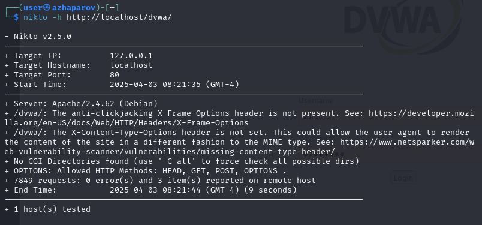

---
## Front matter
lang: ru-RU
title: Индивидуальный проект - этап 4
author: |
	 Жапаров Алишер Дастанбекович\inst{1}

institute: |
	\inst{1}Российский Университет Дружбы Народов

date: 19 марта, 2025, Москва, Россия

## Formatting
mainfont: PT Serif
romanfont: PT Serif
sansfont: PT Sans
monofont: PT Mono
toc: false
slide_level: 2
theme: metropolis
header-includes: 
 - \metroset{progressbar=frametitle,sectionpage=progressbar,numbering=fraction}
 - '\makeatletter'
 - '\beamer@ignorenonframefalse'
 - '\makeatother'
aspectratio: 43
section-titles: true

---

# Цели и задачи работы

## Цель лабораторной работы

Целью данной работы является изучение сканера уязвимостей nikto.

# Процесс выполнения лабораторной работы

## Введение

**Nikto** — это популярный сканер веб-серверов с открытым исходным кодом, который проверяет веб-серверы на наличие уязвимостей, неправильных настроек, устаревших версий ПО и прочих проблем безопасности.

## Введение

Nikto написан на Perl, и для его работы необходимо наличие Perl на системе.

Сканирование веб-сервера
```bash
perl nikto.pl -h <URL>
```

## Сканирование

Nikto может использоваться для пассивного сканирования DVWA, выявления базовых уязвимостей и проверок на неправильную конфигурацию.

Когда DVWA запущено, мы можем использовать Nikto для сканирования. Основной командой для сканирования будет:

```bash
perl nikto.pl -h http://localhost/dvwa/
```

## Сканирование localhost

{ #fig:001 width=70% height=70% }

## Сканирование localhost/dvwa/

{ #fig:002 width=70% height=70% }

# Выводы по проделанной работе

## Вывод

Мы изучили возможности сканера nikto.