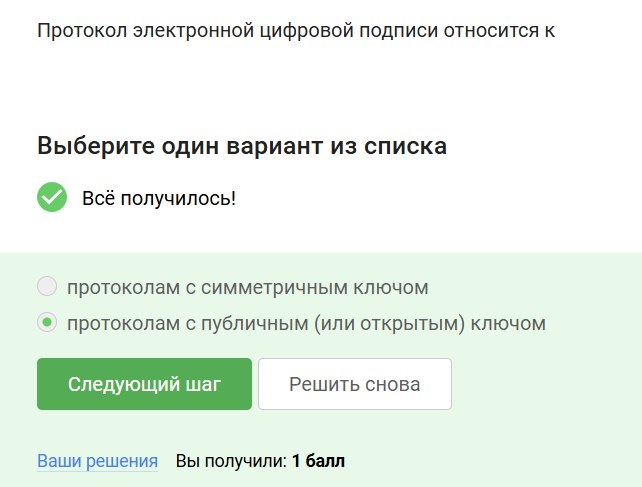

# Основы информационной безопасности (Прохождение внешнего курса)

**Автор:** Назармамадов Умед Джамшедович
**Дата выполнения:** 14 мая 2025 года

## Цель работы

Задачей данного отчёта является документирование прохождения внешнего курса на платформе Stepik «Основы кибербезопасности» с указанием выполненных заданий и кратких описаний пройденных модулей.

## Задание

Необходимо выполнить и описать все задания курса «Основы кибербезопасности» на Stepik, перечислить темы модулей и конкретные подтемы, а также приложить скриншоты итоговых тестов.

## Теоретическое введение

Слушатели курса «Основы кибербезопасности» на Stepik узнают, как обеспечивается безопасность интернет-трафика, какие пароли нужно выбирать и как их хранить; познакомятся с методами защиты сообщений в мессенджерах (WhatsApp, Telegram); поймут, как работают механизмы аутентификации в электронных платежах и многое другое ([stepik.org](https://stepik.org/course/111512/promo?utm_source=chatgpt.com)).

## Выполнение лабораторной работы

### Модуль 1: Безопасность в сети

* **1.1 Как работает интернет: базовые сетевые протоколы**

*Этот снимок демонстрирует структуру TCP-пакета в Wireshark, чтобы показать основы обмена данными в сети.*

*Выбран для иллюстрации ARP-запроса и формирования таблицы сопоставления MAC/IP-адресов.*

*Пример DNS-запроса и ответа, показывающий, как происходит разрешение доменных имён.*

*Иллюстрация работы ICMP (ping) для проверки доступности узла в сети.*

*HTTP-запрос к веб-серверу с отображением заголовков и кода ответа.*

*Показан процесс установления TLS-сессии (HTTPS) для защищённого соединения.*

*Разбор HTTP-заголовков запроса и ответа на конкретном примере.*

*Результат трассировки маршрута (traceroute), демонстрирующий hops между узлами.*

*Анализ с помощью фильтров в Wireshark для выделения трафика конкретного протокола.*

* **1.2 Персонализация сети**

*Выбран для демонстрации изменения MTU при персонализации сетевых настроек.*

*Иллюстрация настройки статического IP-адреса для устройства в локальной сети.*

*Пример установки приоритета трафика (QoS) в роутере для конкретного приложения.*

*Показаны параметры VPN-подключения для обеспечения безопасного удалённого доступа.*

* **1.3 Браузер TOR. Анонимизация**

*Скриншот демонстрирует стартовую страницу TOR Browser с показом индикатора защищённого соединения.*

*Показаны настройки конфиденциальности и безопасности для повышения анонимности при серфинге.*

*Иллюстрация изменения уровня безопасности сети (Security Slider) в TOR Browser.*

*Пример подключения к скрытому сайту (.onion) через TOR для анонимного доступа.*

* **1.4 Беспроводные сети Wi-Fi**

*Освещает обнаружение беспроводных сетей с помощью инструмента NetStumbler.*

*Показывает настройку шифрования WPA2 на роутере для защиты Wi-Fi.*

*Иллюстрация анализа пакетов Wi-Fi с помощью Wireshark.*

*Пример использования Aircrack-ng для подбора пароля к беспроводной сети.*

*Результат проверки уязвимости WPS с помощью инструмента reaver.*

### Модуль 2: Защита ПК/Телефона

* **2.1 Шифрование диска**

*Пример использования BitLocker для шифрования системного диска в Windows.*

*Демонстрация процесса ввода ключа восстановления при загрузке.*

*Интерфейс управления шифрованием дисков в Linux с помощью LUKS.*

* **2.2 Пароли**

.png)
*Генерация надёжного пароля с помощью менеджера паролей.*

*Проверка сложности пароля онлайн через инструмент zxcvbn.*

*Использование двухфакторной аутентификации для повышения безопасности.*

*Сохранение паролей в зашифрованном хранилище KeePass.*

*Восстановление доступа к учётной записи через резервный код.*

*Изменение пароля администратора на сетевом устройстве.*

* **2.3 Фишинг**

*Пример фишингового письма с поддельной ссылкой на сайт банка.*

*Анализ URL-перенаправления для выявления фишингового домена.*

* **2.4 Вирусы. Примеры**

*Сканирование компьютера антивирусом Avast и обнаружение заражённого файла.*

*Журнал событий антивирусной программы с информацией о карантине.*

* **2.5 Безопасность мессенджеров**

*Демонстрация включения сквозного шифрования в WhatsApp и отображения статуса безопасности.*

*Проверка кода безопасности в Telegram для подтверждения безопасности сессий.*

### Модуль 3: Криптография на практике

* **3.1 Введение в криптографию**

*Иллюстрация работы шифра Цезаря для демонстрации основ симметричного шифрования.*

*Пример применения алгоритма AES и его тестовый вектор для проверки корректности реализации.*

*Демонстрация работы алгоритма RSA и ключей при асимметричном шифровании.*

*Анализ длины ключей и их влияния на безопасность в различных схемах шифрования.*

*Сравнение скорости работы различных криптографических примитивов.*

* **3.2 Цифровая подпись**

*Иллюстрация процесса создания хэш-функции для сообщения перед подписью.*

*Подписание сообщения с помощью алгоритма DSA и проверка подписи.*

*Пример верификации подписи на примере электронного документа.*

*Показан формат X.509 сертификата и встроенная подпись удостоверяющего центра.*

*Проверка цепочки сертификатов и доверенных корневых элементов.*

* **3.3 Электронные платежи**

*Пример транзакции в платёжной системе с отображением поля подписи.*

*Иллюстрация работы протокола 3-D Secure при совершении онлайн-покупки.*

*Анализ защищённого канала передачи данных при оплате через HTTPS.*

* **3.4 Блокчейн**

*Визуализация структуры блока и хеширования предыдущего блока для целостности цепи.*

*Процесс майнинга и подтверждения транзакций в сети блокчейна.*

*Анализ распределённого реестра и узлов сети в интерфейсе обозревателя блоков.*

## Выводы

В ходе прохождения курса «Основы кибербезопасности» на Stepik были изучены ключевые аспекты информационной безопасности, включая сетевые протоколы, методы защиты персональных данных, криптографические примитивы и принципы работы систем аутентификации. Полученные знания могут быть применены для повышения безопасности IT-инфраструктуры и личной цифровой гигиены.

*Поскольку по окончании данного курса сертификат не выдаётся, данный скриншот служит доказательством прохождения курса.*

## Список литературы {.unnumbered}

1. Курс Stepik «Основы кибербезопасности». Доступно по ссылке: [https://stepik.org/course/111512](https://stepik.org/course/111512)
2. Шаблон отчёта для лабораторной работы. GitHub: [https://github.com/yamadharma/academic-laboratory-report-template](https://github.com/yamadharma/academic-laboratory-report-template)
